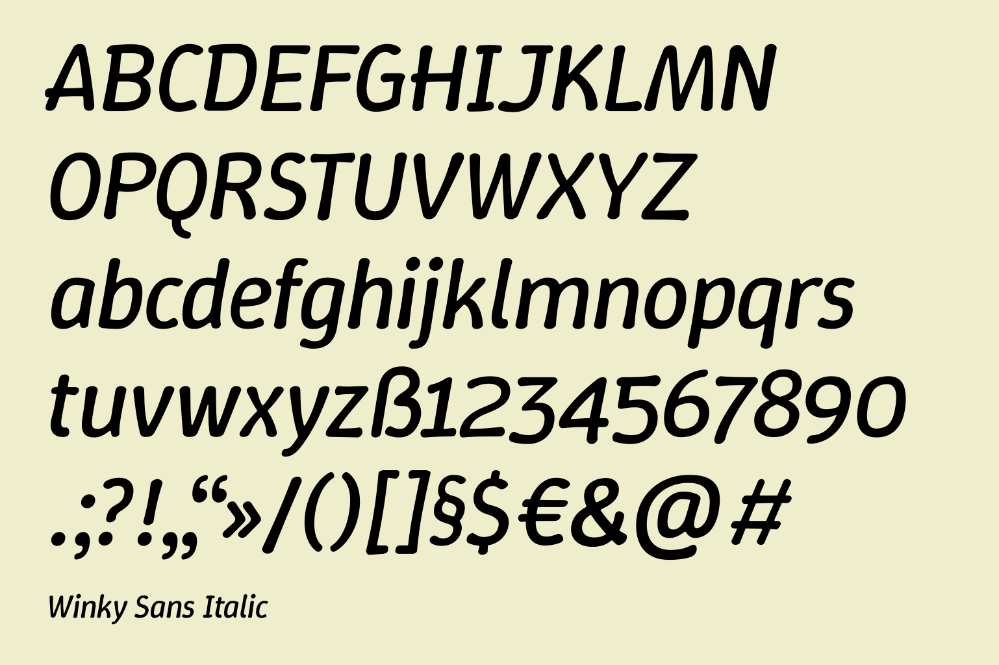
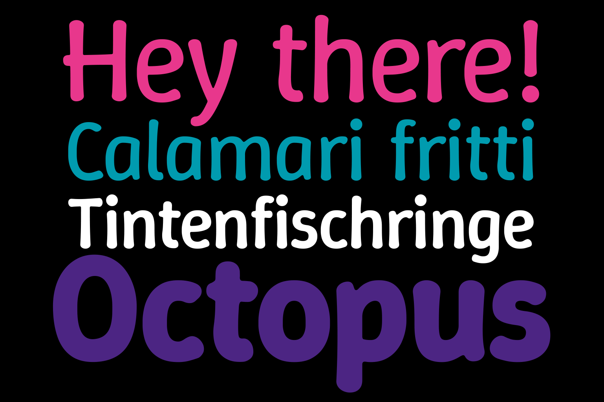

----

# Winky Sans

[![][Fontbakery]](https://typofactur.github.io/winkysans/fontbakery/fontbakery-report.html)
[![][Universal]](https://typofactur.github.io/winkysans/fontbakery/fontbakery-report.html)
[![][GF Profile]](https://typofactur.github.io/winkysans/fontbakery/fontbakery-report.html)
[![][Shaping]](https://typofactur.github.io/winkysans/fontbakery/fontbakery-report.html)

[Fontbakery]: https://img.shields.io/endpoint?url=https%3A%2F%2Fraw.githubusercontent.com%2Ftypofactur%2Fwinkysans%2Fgh-pages%2Fbadges%2Foverall.json
[GF Profile]: https://img.shields.io/endpoint?url=https%3A%2F%2Fraw.githubusercontent.com%2Ftypofactur%2Fwinkysans%2Fgh-pages%2Fbadges%2FGoogleFonts.json
[Outline Correctness]: https://img.shields.io/endpoint?url=https%3A%2F%2Fraw.githubusercontent.com%2Ftypofactur%2Fwinkysans%2Fgh-pages%2Fbadges%2FOutlineCorrectnessChecks.json
[Shaping]: https://img.shields.io/endpoint?url=https%3A%2F%2Fraw.githubusercontent.com%2Ftypofactur%2Fwinkysans%2Fgh-pages%2Fbadges%2FShapingChecks.json
[Universal]: https://img.shields.io/endpoint?url=https%3A%2F%2Fraw.githubusercontent.com%2Ftypofactur%2Fwinkysans%2Fgh-pages%2Fbadges%2FUniversal.json

Winky Sans looks like the sober, grown-up cousin of Comic Sans. Informal and personable, but not silly.

Based on Aniva Sans, the letter shapes are rounded and thickened at the endings, and little irregularities were added, wich results in the impression of handwriting.

Winky Sans is a variable font with a weight axis that ranges from Light (300) to Black (900). But be careful! Like flowing ink on paper the forms grows in all directions.
While the slim weights might have been written with a fineliner, the black style look like ink blots from a broken pen.

See also Winky Rough, an alternative version of the font imitating dried ink on rough paper.

## About

typofactur is a German type foundry run by the graphic designer Simon Atzbach.
Find out more at https://typofactur.de

## Building

Fonts are built automatically by GitHub Actions - take a look in the "Actions" tab for the latest build.

If you want to build fonts manually on your own computer:

* `make build` will produce font files.
* `make test` will run [FontBakery](https://github.com/googlefonts/fontbakery)'s quality assurance tests.
* `make proof` will generate HTML proof files.

The proof files and QA tests are also available automatically via GitHub Actions - look at https://typofactur.github.io/winkysans.git.

## Changelog

When you update your font (new version or new release), please report all notable changes here, with a date.
[Font Versioning](https://github.com/googlefonts/gf-docs/tree/main/Spec#font-versioning) is based on semver. 
Changelog example:

**22 December 2024. Version 1.000**
- initial release

**27 December 2024. Version 1.002**
- accents bolder
- analog to Winky Rough

**03 January 2025. Version 1.003**
- Z and z
- commaturdenmod added
- jacute without dot

**03 January 2025. Version 1.004**
- schwa

**03 January 2025. Version 1.100**
- kerning with Kern On
- Italic added
- commaaccentcomb

**04 January 2025. Version 1.101**
- dottedCircle added
- no ligatures
- no commaturnedabove

**05 January 2025. Version 1.200**
- Italic 9° instead if 12°
- Schwa, H, H.salt
- glyphspackage instead of glyphs
- mark ogonek in dottedcircle

**05 January 2025. Version 1.201**
- fractions

## License

This Font Software is licensed under the SIL Open Font License, Version 1.1.
This license is available with a FAQ at https://openfontlicense.org

## Repository Layout

This font repository structure is inspired by [Unified Font Repository v0.3](https://github.com/unified-font-repository/Unified-Font-Repository), modified for the Google Fonts workflow.
